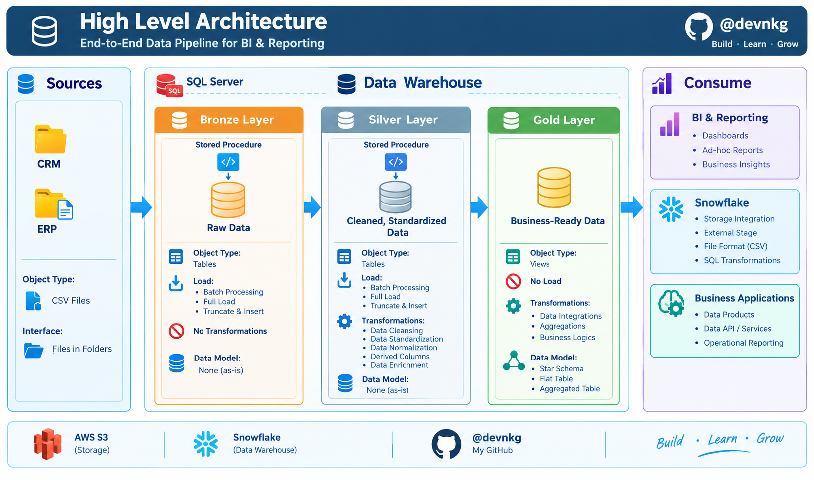

# Data Warehouse and Analytics Project

Welcome to the **Data Warehouse and Analytics Project** repository! 🚀  
This project demonstrates a comprehensive data warehousing and analytics solution, from building a data warehouse to generating actionable insights. Designed as a portfolio project, it highlights industry best practices in data engineering and analytics.

---
## 🏗️ Data Architecture

The data architecture for this project follows Medallion Architecture **Bronze**, **Silver**, and **Gold** layers:


1. **Bronze Layer**: Stores raw data as-is from the source systems. Data is ingested from CSV Files into Snowflake Database.
2. **Silver Layer**: This layer includes data cleansing, standardization, and normalization processes to prepare data for analysis.
3. **Gold Layer**: Houses business-ready data modeled into a star schema required for reporting and analytics.

---
## 📖 Project Overview

This project involves:

1. **Data Architecture**: Designing a Modern Data Warehouse Using Medallion Architecture **Bronze**, **Silver**, and **Gold** layers.
2. **ETL Pipelines**: Extracting, transforming, and loading data from source systems into the warehouse.
3. **Data Modeling**: Developing fact and dimension tables optimized for analytical queries.
4. **Analytics & Reporting**: Creating SQL-based reports and dashboards for actionable insights.

🎯 This repository is an excellent resource for professionals and students looking to showcase expertise in:
- SQL Development
- Data Architect
- Data Engineering  
- ETL Pipeline Developer  
- Data Modeling  
- Data Analytics  

---

## 🛠️ Important Links & Tools:

Everything is for Free!
- **[Datasets](datasets/):** Access to the project dataset (csv files).
- **[Snowflake Free Trial](https://signup.snowflake.com/):** Cloud data platform for hosting your Snowflake data warehouse.
- **[Snowflake Snowsight](https://docs.snowflake.com/en/user-guide/ui-snowsight):** Web-based GUI for querying, managing, and interacting with databases.
- **[Git Repository](https://github.com/):** Set up a GitHub account and repository to manage, version, and collaborate on your code efficiently.
- **[DrawIO](https://www.drawio.com/):** Design data architecture, models, flows, and diagrams.
- **[Notion](https://www.notion.com/):** All-in-one tool for project management and organization.
- **[Notion Project Steps](https://app.notion.com/p/SQL-Data-Warehouse-Project-3ac5d79b8c2282c1a45a819d38e0c2d9?source=copy_link):** Access to All Project Phases and Tasks.

---

## 🚀 Project Requirements

### Building the Data Warehouse (Data Engineering)

#### Objective
Develop a modern data warehouse using Snowflake to consolidate sales data, enabling analytical reporting and informed decision-making.

#### Specifications
- **Data Sources**: Import data from two source systems (ERP and CRM) provided as CSV files.
- **Data Quality**: Cleanse and resolve data quality issues prior to analysis.
- **Integration**: Combine both sources into a single, user-friendly data model designed for analytical queries.
- **Scope**: Focus on the latest dataset only; historization of data is not required.
- **Documentation**: Provide clear documentation of the data model to support both business stakeholders and analytics teams.

---

### BI: Analytics & Reporting (Data Analysis)

#### Objective
Develop SQL-based analytics to deliver detailed insights into:
- **Customer Behavior**
- **Product Performance**
- **Sales Trends**

These insights empower stakeholders with key business metrics, enabling strategic decision-making.  


## 📂 Repository Structure

```text
sql-data-warehouse-project/
├── datasets/                          # Raw ERP and CRM source datasets
├── docs/                              # Architecture and project documentation
│   ├── data_architecture.drawio       # High-level warehouse architecture
│   ├── data_catalog.md                # Dataset metadata and field descriptions
│   ├── data_flow.drawio               # Pipeline flow diagram
│   ├── data_models.drawio             # Dimensional model design
│  
├── scripts/                           # SQL scripts for pipeline layers
│   ├── bronze/                        # Raw ingestion and staging logic
│   │   ├── ddl_bronze.sql             # Bronze table definitions
│   │   └── proc_load_bronze.sql       # Bronze load procedure
│   ├── silver/                        # Data cleansing and transformation
│   │   ├── ddl_silver.sql             # Silver table definitions
│   │   └── proc_load_silver.sql       # Silver ETL procedure
│   └── gold/                          # Analytical data models
│       ├── ddl_gold.sql               # Gold schema and tables
│       └── views_gold.sql             # Reporting views
├── tests/                             # Data validation and quality checks
│   ├── quality_checks_silver.sql      # Silver layer validation scripts
│   └── quality_checks_gold.sql        # Gold layer validation scripts
├── README.md                          # Project overview and usage guide
├── LICENSE                            # License information
├── .gitignore                         # Git ignore rules
└── docs/requirements.md               # Business and technical requirements
```
## 🛡️ License

This project is licensed under the [MIT License](LICENSE). You are free to use, modify, and share this project with proper attribution.

## 🌟 About Me

Hi there! I'm **Nandkishore Geete**. I’m a Data Engineer passionate about building scalable data pipelines, cloud warehouses, and modern analytics solutions!

Let's stay in touch! Feel free to connect with me:

[](https://linkedin.com/in/nandkishoregeete)
[](https://github.com/devnkg)